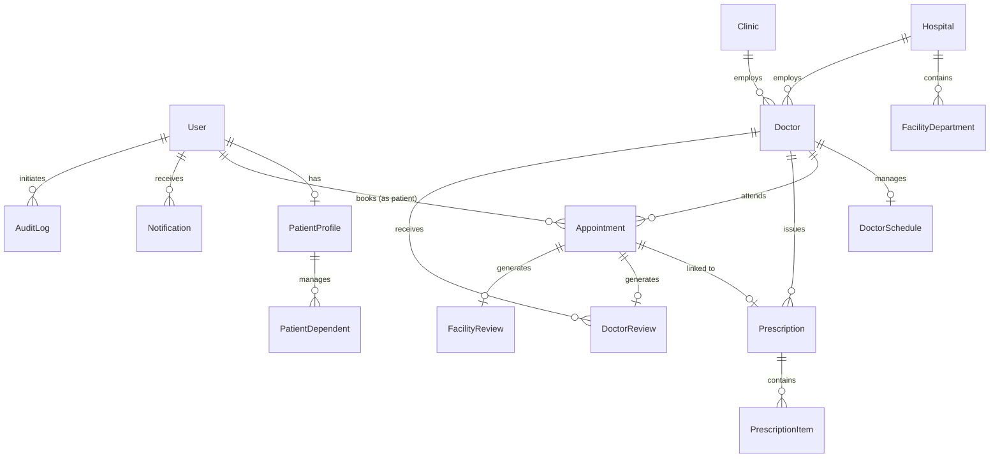

# MeetAdr Backend API Service

[](https://www.python.org/)
[](https://www.djangoproject.com/)
[](https://www.django-rest-framework.org/)
[](https://www.postgresql.org/)
[](https://supabase.com/)
[]()

Enterprise healthcare appointment booking and provider discovery platform backend powering **meetAdr**. Built with Django 4.2 REST Framework, PostgreSQL (Supabase), JWT Authentication, and OpenAPI 3.0 (drf-spectacular).

---

## Table of Contents

- [Overview & Architecture](#overview--architecture)
- [Tech Stack](#tech-stack)
- [Project Directory Structure](#project-directory-structure)
- [Prerequisites](#prerequisites)
- [Local Setup & Installation](#local-setup--installation)
- [Database Configuration & Supabase](#database-configuration--supabase)
- [Running Migrations & Seeding Data](#running-migrations--seeding-data)
- [Starting the Development Server](#starting-the-development-server)
- [API Documentation & Schema](#api-documentation--schema)
- [Authentication & Role-Based Access Control](#authentication--role-based-access-control)
- [Database Schema & ER Diagram](#database-schema--er-diagram)
- [Completed Features & Endpoints](#completed-features--endpoints)
- [Known Limitations & Roadmap](#known-limitations--roadmap)
- [Running Automated Tests](#running-automated-tests)

---

## Overview & Architecture

The meetAdr backend is architected following clean domain-driven modular Django application patterns:

- **`apps.accounts`**: Custom UUID-based User model, multi-role authentication (Patient, Doctor, Hospital Admin, Superadmin), JWT sessions with token blacklisting, and patient profile management.
- **`apps.facilities`**: Accredited hospital and clinic directories, department hierarchies, insurance network affiliations, and facility review system.
- **`apps.doctors`**: Doctor directory, multi-faceted filtering (specialty, location, facility, rating, availability day), doctor schedules, and weekly recurring slots.
- **`apps.appointments`**: Double-booking-proof appointment scheduling, status transitions (`pending` -> `confirmed` -> `completed`/`cancelled`/`no_show`), patient and facility reviews.
- **`apps.prescriptions`**: Digital prescription issuance, medication line items, dosage schedules, and active consultation links.
- **`apps.onboarding`**: Hospital/clinic provider verification workflow, invitation tokens, and document validation.
- **`apps.notifications`**: In-app patient and provider notification center.
- **`apps.audit`**: Immutable security audit logs for compliance tracking.

---

## Tech Stack

| Layer | Technology |
| :--- | :--- |
| **Language** | Python 3.12+ |
| **Framework** | Django 4.2 LTS |
| **API Engine** | Django REST Framework (DRF) |
| **Auth** | `django-rest-framework-simplejwt` (HMAC-SHA256, Refresh Token Rotation) |
| **Database** | PostgreSQL 17 (Supabase / Supavisor Connection Pooling) |
| **DB Driver** | `psycopg2-binary` 2.9+ / `dj-database-url` |
| **API Docs** | OpenAPI 3.0 via `drf-spectacular` (Swagger UI & ReDoc) |
| **CORS** | `django-cors-headers` |

---

## Project Directory Structure

```
backend/
├── apps/
│   ├── accounts/          # User auth, JWT, roles, patient profile
│   ├── appointments/      # Booking lifecycle, slots, reviews
│   ├── audit/             # Audit logs & compliance
│   ├── doctors/           # Doctor directory, schedules & filters
│   ├── facilities/        # Hospitals, clinics, departments & insurance
│   ├── notifications/     # Real-time and in-app notifications
│   ├── onboarding/        # Healthcare provider onboarding & invitations
│   └── prescriptions/     # Digital prescription issuance & medications
├── config/
│   ├── settings/
│   │   ├── base.py        # Shared Django settings
│   │   ├── local.py       # Development environment settings
│   │   └── production.py  # Production hardening & storage
│   ├── asgi.py
│   ├── health_views.py    # Health check endpoint (/api/v1/health/)
│   ├── urls.py            # Canonical URL routing
│   └── wsgi.py
├── docs/                  # In-depth architectural & security docs
├── requirements/
│   ├── base.txt           # Base package requirements
│   ├── local.txt          # Development dependencies
│   └── production.txt     # Production dependencies (gunicorn, storages)
├── manage.py              # Django management script
├── openapi-schema.json    # Complete OpenAPI 3.0 Schema
├── requirements.txt       # Root entrypoint requirements
├── seed_local_db.py       # Idempotent demo database seeder
└── .env.example           # Environment template
```

---

## Prerequisites

- **Python**: `3.12.x` or higher
- **pip** and **virtualenv**
- **PostgreSQL 14+** or a **Supabase** account

---

## Local Setup & Installation

### 1. Clone the Repository
```bash
git clone https://github.com/ajmal-mubarak/meetadrbackend.git
cd meetadrbackend
```

### 2. Create and Activate Virtual Environment
**Windows (PowerShell):**
```powershell
python -m venv .venv
.venv\Scripts\Activate.ps1
```

**Linux / macOS:**
```bash
python3 -m venv .venv
source .venv/bin/activate
```

### 3. Install Dependencies
```bash
pip install --upgrade pip
pip install -r requirements.txt
```

---

## Database Configuration & Supabase

Create your `.env` file from the provided template:
```bash
cp .env.example .env
```

### Supabase PostgreSQL Connection
Supabase free and pro tiers assign an IPv6-only address to direct database hosts (`db.<project-ref>.supabase.co`). On standard IPv4 consumer and office networks, use the **Supabase Connection Pooler (Session Mode port 5432)**:

```env
# .env
DJANGO_SECRET_KEY=your-secure-random-secret-key
DEBUG=True
DJANGO_ALLOWED_HOSTS=localhost,127.0.0.1,*
DJANGO_SETTINGS_MODULE=config.settings.local

# Supabase Session Pooler (IPv4 compatible):
DATABASE_URL=postgresql://postgres.<project-ref>:<encoded-password>@aws-0-<region>.pooler.supabase.com:5432/postgres?sslmode=require

# Frontend URL
FRONTEND_URL=http://localhost:3000
```

> **Note on Special Characters in Passwords**: If your database password contains special characters like `@` or `:`, URL percent-encode them (e.g., `@` becomes `%40`).

---

## Running Migrations & Seeding Data

### Apply All Migrations:
```bash
python manage.py migrate
```

### Populate Seed Data (Hospitals, Clinics, 17 Doctors, Demo Users):
```bash
python seed_local_db.py
```

### Seeded Demo Accounts:
| Role | Email | Password |
| :--- | :--- | :--- |
| **Patient** | `patient@meetadr.demo` | `Patient@123` |
| **Doctor** | `doctor@meetadr.demo` | `Doctor@123` |
| **Hospital Admin** | `hospital@meetadr.demo` | `Hospital@123` |
| **Superadmin** | `admin@meetadr.demo` | `Admin@123` |

---

## Starting the Development Server

```bash
python manage.py runserver 0.0.0.0:8000
```

The API service will start on `http://localhost:8000`.

---

## API Documentation & Schema

- **Interactive Swagger UI**: [http://localhost:8000/api/docs/](http://localhost:8000/api/docs/)
- **ReDoc Documentation**: [http://localhost:8000/api/redoc/](http://localhost:8000/api/redoc/)
- **OpenAPI Schema (JSON)**: `backend/openapi-schema.json`
- **Container Health Check**: [http://localhost:8000/api/v1/health/](http://localhost:8000/api/v1/health/)

To regenerate the OpenAPI JSON schema file at any time:
```bash
python manage.py spectacular --file openapi-schema.json
```

---

## Authentication & Role-Based Access Control

Authentication uses **JWT Bearer tokens**:

1. **Obtain Token**: `POST /api/v1/auth/login/` with `email` and `password`.
2. **Include in Requests**: Add `Authorization: Bearer <access_token>` in HTTP headers.
3. **Token Refresh**: `POST /api/v1/auth/token/refresh/` with `refresh` token.

---

## Database Schema & ER Diagram



---

## Completed Features & Endpoints

### 1. Authentication (`/api/v1/auth/`)
- `POST /login/` - Authenticate & obtain JWT tokens with user profile.
- `POST /register/` - Patient self-registration.
- `POST /token/refresh/` - Refresh expired access tokens.
- `POST /logout/` - Blacklist refresh token & revoke session.
- `GET /me/` - Retrieve authenticated user profile.
- `GET /provider-setup/validate/` - Validate provider invite token.
- `POST /provider-setup/complete/` - Activate invited provider account.

### 2. Patient Portal (`/api/v1/patient/`)
- `GET, PUT, PATCH /profile/` - Patient medical profile & insurance.
- `GET, POST /dependents/` - Family member dependents management.
- `GET, PUT, DELETE /dependents/<id>/` - Dependent detail management.

### 3. Facilities Directory (`/api/v1/`)
- `GET /hospitals/` - Accredited hospital directory with search & department filters.
- `GET /hospitals/<id>/` - Detailed hospital view with departments & doctors.
- `GET /clinics/` - Clinic directory with area & specialty filters.
- `GET /clinics/<id>/` - Clinic detail view.
- `GET /specialties/` - All recognized medical specialties.
- `GET /insurance-plans/` - Accepted insurance networks.

### 4. Doctors & Schedules (`/api/v1/`)
- `GET /doctors/` - Doctor directory with faceted filters (specialty, location, hospital, clinic, day, rating, search keyword).
- `GET /doctors/<id>/` - Doctor detailed profile & credentials.
- `GET /doctors/<id>/availability/?date=YYYY-MM-DD` - Real-time slot availability calculator excluding conflicting bookings.
- `GET /doctors/<id>/reviews/` - Anonymous verified patient reviews.

### 5. Appointments & Booking (`/api/v1/appointments/`)
- `GET /` - List user's appointments (filtered by status or date).
- `POST /` - Atomically book an appointment with double-booking prevention.
- `GET /<id>/` - Appointment detail.
- `POST /<id>/cancel/` - Cancel appointment with validation.
- `POST /<id>/reschedule/` - Atomically reschedule appointment.
- `POST /<id>/review/` - Post verified doctor review.

### 6. Doctor Portal (`/api/v1/doctor/`)
- `GET /dashboard/` - Doctor metrics (today's appointments, patients count, rating).
- `GET /appointments/` - Doctor's appointments list.
- `GET, PUT /schedule/` - Manage weekly availability & slot durations.
- `GET /patients/` - Patients treated by this doctor.

### 7. Facility Admin (`/api/v1/facility/` & `/api/v1/hospital/`)
- `GET /dashboard/` - Facility analytics (occupancy, revenue estimates, volume).
- `GET, POST /doctors/` - Manage affiliated doctors.
- `GET, POST /departments/` - Manage facility departments.

### 8. Prescriptions (`/api/v1/prescriptions/`)
- `GET /my/` - Patient's prescribed medications list.
- `POST /` - Doctor issue digital prescription.
- `GET /<id>/` - Prescription detail with medication instructions.
- `POST /<id>/cancel/` - Invalidate prescription.

### 9. Platform Superadmin (`/api/v1/admin/`)
- `GET /dashboard/` - System-wide KPIs & facility breakdown.
- `GET /providers/` - Onboarding provider requests queue.
- `POST /providers/<id>/approve/` - Approve facility & issue invite.
- `POST /providers/<id>/reject/` - Reject onboarding application.
- `GET /audit-logs/` - Immutable audit log explorer.

---

## Known Limitations & Roadmap

1. **Email Delivery**: Currently configured to use `console.EmailBackend` for development. In production, configure an SMTP or SendGrid/SES backend.
2. **Payment Gateway**: Booking transactions currently record financial amounts without external payment gateway webhooks (Stripe / Telr integration planned for Phase 2).
3. **Telehealth Video**: Appointment records support video appointment flags; WebRTC signaling integration is queued for next release.

---

## Running Automated Tests

```bash
python manage.py test
```
Or with pytest:
```bash
pytest
```
